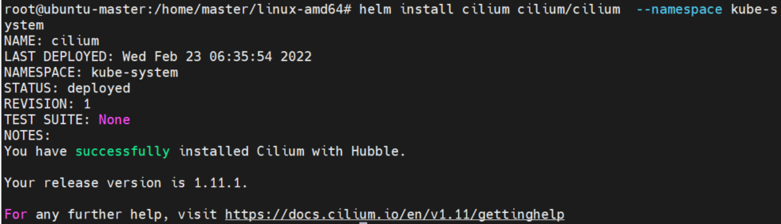

# Cilium install 

## 安装helm

Every release of Helm provides binary releases for a variety of OSes. These binary versions can be manually downloaded and installed.

Download your desired version [helm](https://github.com/helm/helm/releases)
Unpack it (tar -zxvf helm-v3.0.0-linux-amd64.tar.gz)
Find the helm binary in the unpacked directory, and move it to its desired destination (mv linux-amd64/helm /usr/local/bin/helm)
From there, you should be able to run the client and add the stable repo: helm help.

## 安装 Cilium
先是按照网上的教程指定了版本号，结果
```
root@ubuntu-master:/home/master/linux-amd64# helm install cilium cilium/cilium --version 1.9.12 --namespace kube-system
Error: INSTALLATION FAILED: failed to download "cilium/cilium" at version "1.9.12"
```

接着我试着把版本号去掉，就显示成功了


可是安装很久之后，一直显示
```
root@ubuntu-master:/home/master# kubectl get pods -n kube-system -o wide
NAME                                    READY   STATUS                  RESTARTS   AGE     IP               NODE            NOMINATED NODE   READINESS GATES
cilium-8xc8s                            0/1     Init:ImagePullBackOff   0          24m     192.168.25.152   ubuntu-node1    <none>           <none>
cilium-hr6zc                            0/1     Init:ImagePullBackOff   0          24m     192.168.25.153   ubuntu-node2    <none>           <none>
cilium-operator-795b8db95f-k9n57        0/1     ImagePullBackOff        0          24m     192.168.25.153   ubuntu-node2    <none>           <none>
cilium-operator-795b8db95f-xjfx6        0/1     ImagePullBackOff        0          24m     192.168.25.152   ubuntu-node1    <none>           <none>
cilium-x2nw6                            0/1     Init:ImagePullBackOff   0          24m     192.168.25.151   ubuntu-master   <none>           <none>
coredns-7ff77c879f-5sx6d                1/1     Running                 0          4h14m   10.244.0.3       ubuntu-master   <none>           <none>
coredns-7ff77c879f-bxbfh                1/1     Running                 0          4h14m   10.244.0.2       ubuntu-master   <none>           <none>
etcd-ubuntu-master                      1/1     Running                 0          4h15m   192.168.25.151   ubuntu-master   <none>           <none>
kube-apiserver-ubuntu-master            1/1     Running                 0          4h15m   192.168.25.151   ubuntu-master   <none>           <none>
```
这还是有问题呀。

还是先删除了吧，执行命令`helm -n kube-system uninstall cilium`：
```
root@ubuntu-master:/home/master# helm -n kube-system uninstall cilium
release "cilium" uninstalled
root@ubuntu-master:/home/master# kubectl get pods -n kube-system -o wide
NAME                                    READY   STATUS        RESTARTS   AGE     IP               NODE            NOMINATED NODE   READINESS GATES
cilium-operator-795b8db95f-k9n57        0/1     Terminating   0          24m     192.168.25.153   ubuntu-node2    <none>           <none>
cilium-operator-795b8db95f-xjfx6        0/1     Terminating   0          24m     192.168.25.152   ubuntu-node1    <none>           <none>
coredns-7ff77c879f-5sx6d                1/1     Running       0          4h15m   10.244.0.3       ubuntu-master   <none>           <none>
coredns-7ff77c879f-bxbfh                1/1     Running       0          4h15m   10.244.0.2       ubuntu-master   <none>           <none>
```
然后就看到Cilium相关的pods一个个的消失。


又看到一个安装操作，是需要先安装Cilium CNI，安装Cilium CNI需要卸载Flannel CNI

```
# 一般生产环境是不会这样操作的，因为一旦把 cni 卸载后，所有pod 都会因为没有对应cni 支持，导致pod 无法正常运行和通信异常；
# 生产环境如果涉及需要更换cni ，一般不会涉及，即便涉及到更换cni的，也会采用新部署一套集群，然后进行迁移；
# 卸载flannel cni 插件：
# 根据部署时记录，确认版本；
[root@master ~]# kubectl delete -f https://raw.githubusercontent.com/coreos/flannel/master/Documentation/kube-flannel.yml
podsecuritypolicy.policy "psp.flannel.unprivileged" deleted
clusterrole.rbac.authorization.k8s.io "flannel" deleted
clusterrolebinding.rbac.authorization.k8s.io "flannel" deleted
serviceaccount "flannel" deleted
configmap "kube-flannel-cfg" deleted
daemonset.apps "kube-flannel-ds" deleted
[root@master ~]#

[root@master ~]# ll /var/lib/cni/
total 12
drwx------ 3 root root 4096 Oct 28 23:13 cache
drwx------ 2 root root 4096 Nov 17 22:11 flannel
drwxr-xr-x 3 root root 4096 Oct 28 23:13 networks
[root@master ~]# mv /var/lib/cni/ /var/lib/cni.bak
[root@master ~]# ll /var/lib/cni.bak/
cache/    flannel/  networks/
[root@master ~]# ll /etc/cni/net.d/
total 4
-rw-r--r-- 1 root root 292 Nov 17 21:15 10-flannel.conflist
[root@master ~]# mv /etc/cni/net.d/10-flannel.conflist /etc/cni/net.d/10-flannel.conflist.bak
[root@master ~]# systemctl restart kubelet
[root@master ~]#

```

## Install Cilium CNI
```
wget https://raw.githubusercontent.com/cilium/cilium/1.9.0/install/kubernetes/quick-install.yaml
kubectl create -f quick-install.yaml
```

cilium 提供了一个kernel_check 的job ；

```
wget https://raw.githubusercontent.com/cilium/cilium/master/examples/kubernetes/kernel-check/kernel-check.yaml
kubectl apply -f kernel-check.yaml
```

## 最后的解决方案
### 安装helm

Every release of Helm provides binary releases for a variety of OSes. These binary versions can be manually downloaded and installed.

Download your desired version [helm](https://github.com/helm/helm/releases)
Unpack it (tar -zxvf helm-v3.0.0-linux-amd64.tar.gz)
Find the helm binary in the unpacked directory, and move it to its desired destination (mv linux-amd64/helm /usr/local/bin/helm)
From there, you should be able to run the client and add the stable repo: helm help.

### 安装 Cilium
先是按照网上的教程指定了版本号，结果
```
root@ubuntu-master:/home/master/linux-amd64# helm install cilium cilium/cilium --version 1.9.12 --namespace kube-system
Error: INSTALLATION FAILED: failed to download "cilium/cilium" at version "1.9.12"
```
然后我看到网上有个人用的是1.7.2，就改为1.7.2，尝试结果如下：
```
root@ubuntu-master:/home/master#  helm install cilium cilium/cilium --version 1.7.2 --namespace kube-system
NAME: cilium
LAST DEPLOYED: Wed Feb 23 08:27:45 2022
NAMESPACE: kube-system
STATUS: deployed
REVISION: 1
TEST SUITE: None
```

很遗憾，折腾了这么久还是不成功!!!
先放弃了，做点其他事情。


## 参考链接
[虚拟网络之Kubernetes Cilium CNI 快速部署实操](https://blog.csdn.net/LL845876425/article/details/110410377)
