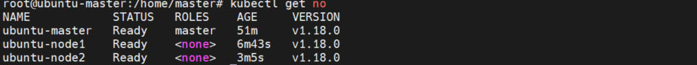

注： 本文章严重参考链接文章，但单独使用两者的时候都遇到了不少问题，这里结合两者进行整理输出。

基础环境：Ubuntu18.04 cpu:2 内存：2g

这个直接用VMware创建的。

## 安装步骤记录：

* sshd的开启

```shell
apt install sshd
service sshd start
```

### 安装与配置docker

```shell
# 安装GPG证书
curl -fsSL http://mirrors.aliyun.com/docker-ce/linux/ubuntu/gpg | sudo apt-key add -
# 写入软件源信息
add-apt-repository "deb [arch=amd64] http://mirrors.aliyun.com/docker-ce/linux/ubuntu $(lsb_release -cs) stable"
# 更新软件库
apt-get -y update
# 安装程序
apt-get -y install docker-ce=5:19.03.15~3-0~ubuntu-bionic
# 固定版本
apt-mark hold docker-ce

```

### 设置docker阿里云加速镜像仓库

```shell
mkdir -p /etc/docker
tee /etc/docker/daemon.json <<-'EOF'
{
  "registry-mirrors": ["https://g6ogy192.mirror.aliyuncs.com"],
  "exec-opts": ["native.cgroupdriver=systemd"] 
}
EOF
systemctl daemon-reload
systemctl restart docker

```

### 禁用swap

```sudo
sudo sed -i '/swap/ s/^/#/' /etc/fstab 
sudo swapoff -a
```

### 安装kubeadm, kubelet, kubectl

```shell
# 下载 gpg 密钥
curl https://mirrors.aliyun.com/kubernetes/apt/doc/apt-key.gpg | apt-key add -
# 添加 k8s 镜像源
cat <<EOF > /etc/apt/sources.list.d/kubernetes.list
deb https://mirrors.aliyun.com/kubernetes/apt/ kubernetes-xenial main
EOF
# 更新软件库
apt-get update
# 安装程序
apt-get install -y kubelet=1.18.0-00 kubeadm=1.18.0-00 kubectl=1.18.0-00
# 固定版本
apt-mark hold kubelet kubeadm kubectl

```


## **注意：以上步骤对于master和node节点的执行步骤是完全一样的，以下的步骤会有不同，请注意区分。**


## k8s集群初始化

### 初始化master节点

```sudo
kubeadm init --image-repository registry.aliyuncs.com/google_containers --service-cidr=10.96.0.0/12  --pod-network-cidr=10.244.0.0/16  --ignore-preflight-errors=Swap
```

执行完结果如下：


### 拷贝配置文件到默认路径

这里按照上面的提示执行即可：

```sudo
mkdir -p $HOME/.kube
sudo cp -i /etc/kubernetes/admin.conf $HOME/.kube/config
sudo chown $(id -u):$(id -g) $HOME/.kube/config
```

根据初始化结果提示，我们需要安装网络插件。本次我们使用flannel作为集群的网络插件，将flannel配置文件从互联网保存到master1，文件地址为：https://raw.githubusercontent.com/flannel-io/flannel/master/Documentation/kube-flannel.yml，在master1上将文件命名为kube-flannel.yml，后执行以下命令

`kubectl apply -f kube-flannel.yml`  
  
如看到如下信息，即网络插件安装成功

```sudo
podsecuritypolicy.policy/psp.flannel.unprivileged created
clusterrole.rbac.authorization.k8s.io/flannel created
clusterrolebinding.rbac.authorization.k8s.io/flannel created
serviceaccount/flannel created
configmap/kube-flannel-cfg created
daemonset.apps/kube-flannel-ds created
```

### node节点加入到集群中

在master执行成功后输出的部分信息：

```sudo
kubeadm join 192.168.25.151:6443 --token 5wgceh.v8vjplqg28rfv8ue \
    --discovery-token-ca-cert-hash sha256:bd4592f22f293941775b835eab57165bb58553d1f603756dd1ad0c986b27c2c9
```

这里的token是之后提供给node节点加入到集群中使用的。

在node节点中执行上述命令：

得到结果：


加入两个node之后在master上查看节点信息：



pods信息


## 参考链接

[基于ubuntu虚拟机的k8s环境搭建（双节点，master+node）](https://segmentfault.com/a/1190000021561713)

[K8S的安装(Ubuntu 20.04)](https://www.jianshu.com/p/520d6414a4ab)

[学习kubernetes，从快速搭建k8s集群开始](https://blog.csdn.net/qq_34330286/article/details/118004838?spm=1001.2014.3001.5502)
