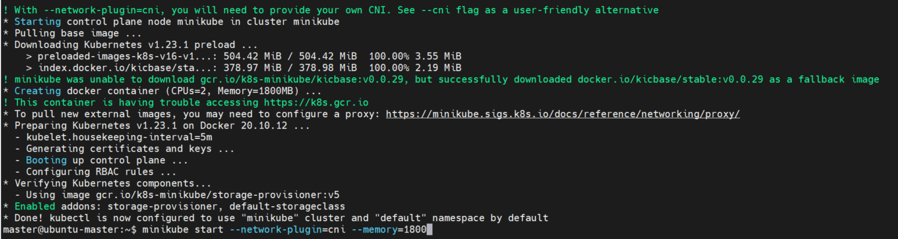
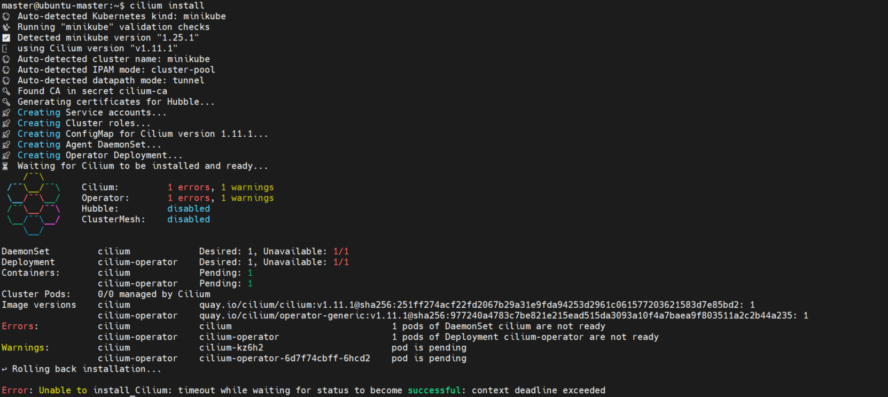

#  开始使用minikube


## 安装 kubectl & minikube

```
curl -LO "https://dl.k8s.io/release/$(curl -L -s https://dl.k8s.io/release/stable.txt)/bin/linux/amd64/kubectl"
sudo install -o root -g root -m 0755 kubectl /usr/local/bin/kubectl

curl -LO https://storage.googleapis.com/minikube/releases/latest/minikube-linux-amd64
sudo install minikube-linux-amd64 /usr/local/bin/minikube
```
- 设置usermod

``` 
sudo usermod -aG docker $USER && newgrp docker
```

- 启动

```
minikube start --network-plugin=cni --memory=1800
```




## 安装Cilium

```
curl -LO https://github.com/cilium/cilium-cli/releases/latest/download/cilium-linux-amd64.tar.gz
sudo tar xzvfC cilium-linux-amd64.tar.gz /usr/local/bin
rm cilium-linux-amd64.tar.gz
cilium install
```




[Getting Started Using Minikube](https://docs.cilium.io/en/v1.9/gettingstarted/minikube/)